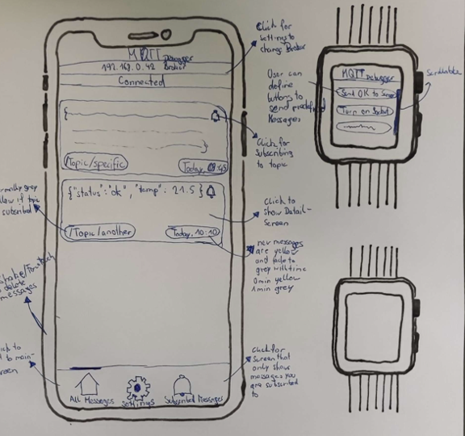
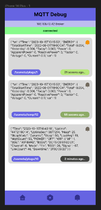

# **MQTTDebug**

Aldin Cimpo, Martin Brandl

---

# Idea

* Quickly view latest messages of your MQTT broker
* Just type in your URL, username & password
* And off you go...


---
# Problem to solve
## Imagine:
* You like home automation
* You don‘t like your data being on the cloud
* You want FULL control
* Which means, you need to care about it on your own
* You need to self-host your MQTT-Broker
* Upon Installation of new devices
* You need to ensure correct messages are sent
* **And this is where MQTTDebug comes into play!**


---
# Mockup




* Connection Status
* Service (stay subscribed in the background)
* Caching

---


---

# Launch mqtt with password 
tested on macOS

```bash
mqtt_passwd -c passwd.txt username
```

nvim /opt/homebrew/etc/mosquitto/mosquitto.conf

```bash
allow_anonymous false
listener 1883

password_file /Users/alsjourney/Desktop/passwd.txt 
```

launch directly or as service
```bash
mosquitto -c /opt/homebrew/etc/mosquitto/mosquitto.conf

brew services start mosquitto
```

edit file here


---

# References
* https://github.com/school-projects-masters-degree/mqttdebug


---
